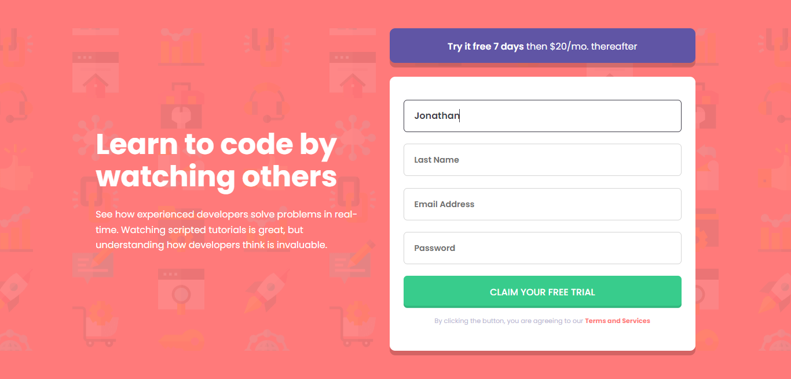
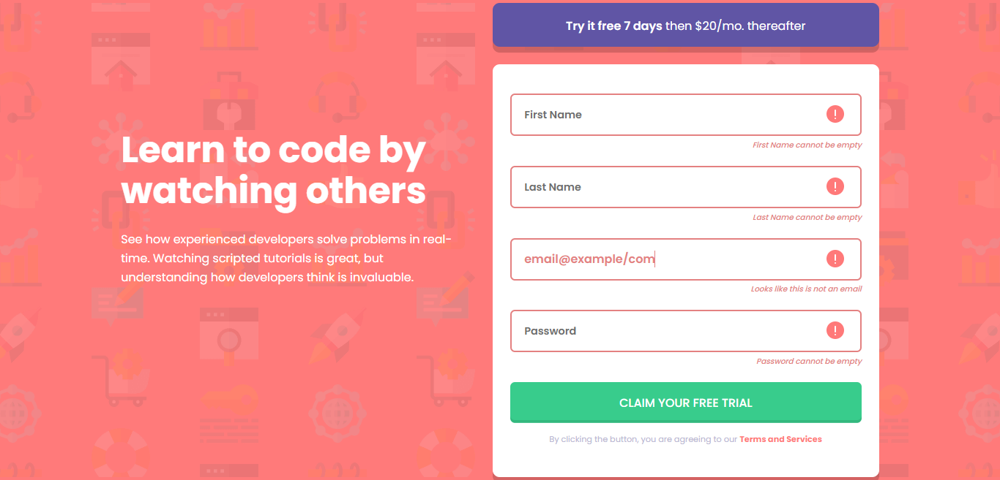
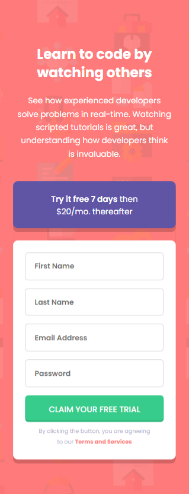

# Frontend Mentor - Intro component with sign up form solution

This is a solution to the [Intro component with sign up form challenge on Frontend Mentor](https://www.frontendmentor.io/challenges/intro-component-with-signup-form-5cf91bd49edda32581d28fd1). Frontend Mentor challenges help you improve your coding skills by building realistic projects. 

## Overview

# Frontend Mentor - Base Apparel coming soon page solution

This is a solution to the [Base Apparel coming soon page challenge on Frontend Mentor](https://www.frontendmentor.io/challenges/base-apparel-coming-soon-page-5d46b47f8db8a7063f9331a0). Frontend Mentor challenges help you improve your coding skills by building realistic projects. 

## Table of contents

  - [The challenge](#the-challenge)
  - [Screenshot](#screenshot)
  - [Links](#links)
  - [My process](#my-process)
  - [Built with](#built-with)
  - [What I learned](#what-i-learned)
  - [Continued development](#continued-development)
  - [Author](#author)

### The challenge

Users should be able to:

- View the optimal layout for the site depending on their device's screen size
- See hover states for all interactive elements on the page
- Receive an error message when the `form` is submitted if:
  - Any `input` field is empty. The message for this error should say *"[Field Name] cannot be empty"*
  - The email address is not formatted correctly (i.e. a correct email address should have this structure: `name@host.tld`). The message for this error should say *"Looks like this is not an email"*

### Screenshot

### Links

- Solution URL: [Github](https://github.com/floatingPebble/floatingPebble.base-apparel-coming-soon-page-FM.io)

## My process

- HTML Layout
- Local CSS variables
- General CSS
- JavaScript
- Mobile CSS
- Desktop CSS

### Built with

- Semantic HTML5 markup
- CSS custom properties
- CSS Flex
- Mobile-first workflow
- Vanilla JavaScript

### What I learned

Improved my knowledge on responsive designs, mobile first aproach, and dealing with SVG.

### Continued development

Random challenges from frontendmentor.io since I am trying to replicate real-job workflow.

- Website - [floatingPebble](https://github.com/floatingPebble)
- Frontend Mentor - [@floatingPebble](https://www.frontendmentor.io/profile/floatingPebble)
- Twitter - [@ShyToadGames](https://twitter.com/ShyToadGames)